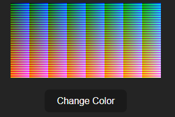

# Colorful

It generates images where each pixel is a always unique and no unused value.

* The initial array is created and filling with 32 values and 8 as the incremental factor value from 8 to 256 as rgb value.
* Pixel array is generated by looping through 3 * 32 iteration process.
* Used randomised algorithem to shuffle the item in the pixel array.